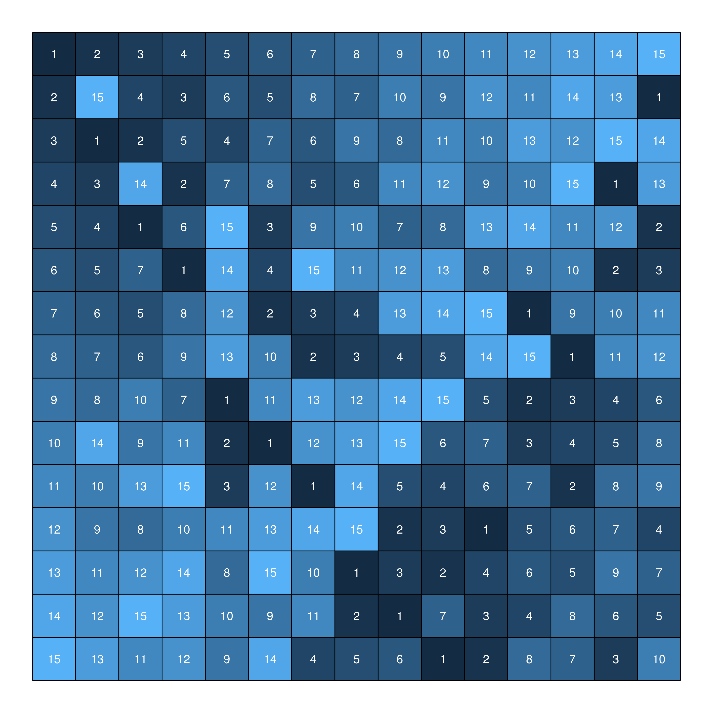
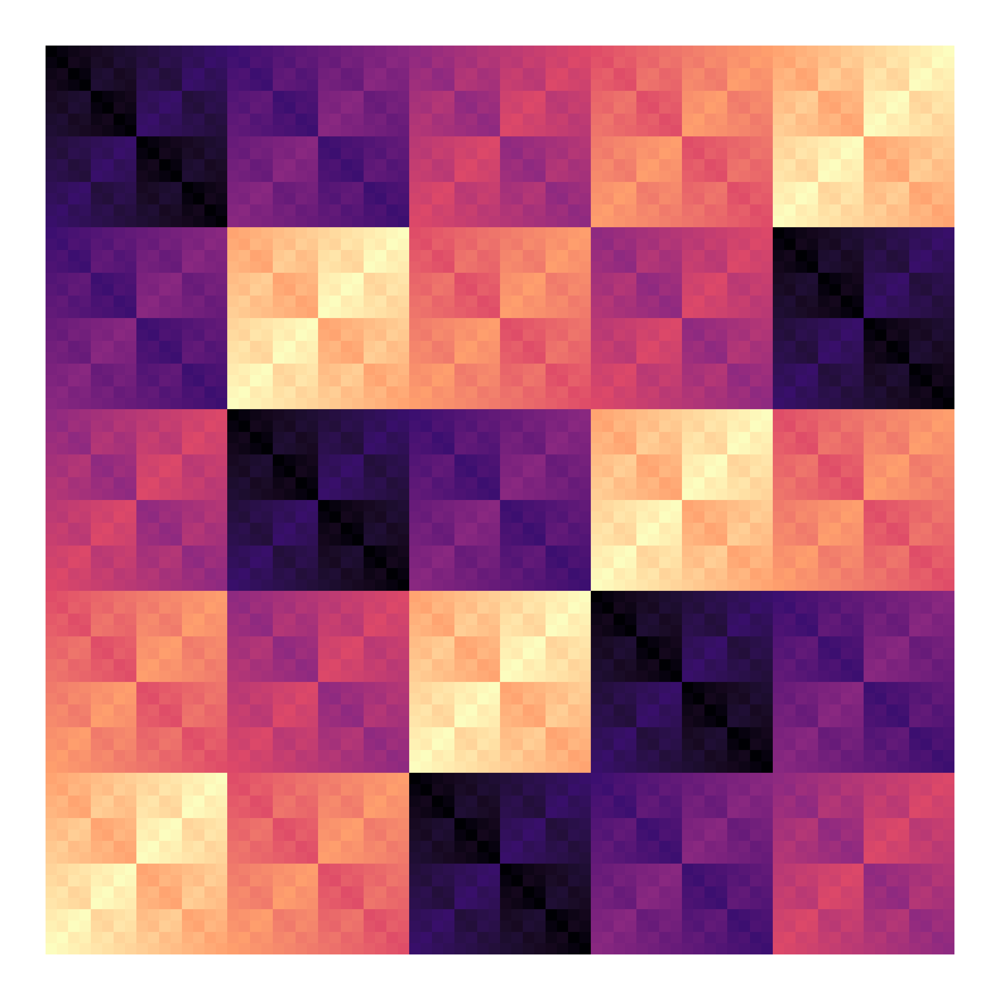

mhall-in-r
================
Matthew Henderson
15/02/2021

## Introduction

This repository contains code for generating latin squares based on the
theorem of Marshall Hall Jr. (1945) which states:

> Given a rectangle of n - r rows and n columns such that each of the
> numbers 1, 2, …, n occurs in every row and no number occurs twice in
> any column, then there exist r rows which may be added to the given
> rectangle to form a latin square.

In `R/add_rows.R` the function `add_rows` is implemented which takes as
input a latin rectangle (represented by a data frame) and outputs a new
latin rectangle with additional rows (how many rows is also specified as
input).

In this report we describe how `add_rows` function works and demonstrate
some of the generated outputs.

## Data frame representations of latin rectangles

A latin rectangle can be represented by an orthogonal array and an
orthogonal array looks just like a data frame with variables for `row`,
`column`, and `symbol`.

(not quite right. an OA can only represent a complete latin square)

For example, the latin rectangle

    1 2 3
    2 3 1

can be represented by the orthgonal array data frame

``` r
library(tidyverse)

tibble(
  row = c(rep(1, 3), rep(2, 3)),
  col = rep(1:3, 2),
  symbol = c(1, 2, 3, 2, 3, 1)
)
#> # A tibble: 6 x 3
#>     row   col symbol
#>   <dbl> <int>  <dbl>
#> 1     1     1      1
#> 2     1     2      2
#> 3     1     3      3
#> 4     2     1      2
#> 5     2     2      3
#> 6     2     3      1
```

The `expand_grid` function makes it easier to construct such a data
frame from a vector of entries.

``` r
expand_grid(row = 1:2, column = 1:3) %>%
  mutate(symbol = c(1, 2, 3, 2, 3, 1))
#> # A tibble: 6 x 3
#>     row column symbol
#>   <int>  <int>  <dbl>
#> 1     1      1      1
#> 2     1      2      2
#> 3     1      3      3
#> 4     2      1      2
#> 5     2      2      3
#> 6     2      3      1
```

A benefit this representation is that it makes it easy to use the
tidyverse packages. For example, we can plot the latin square using
`ggplot2`.

``` r
expand_grid(row = 1:2, column = 1:3) %>%
  mutate(symbol = c(1, 2, 3, 2, 3, 1)) %>%
  ggplot(aes(column, row)) +
  geom_tile(aes(fill = symbol)) +
  geom_text(aes(label = symbol), colour = "white") +
  scale_y_reverse() +
  coord_fixed() +
  theme_void() +
  theme(
    legend.position  = "none",
  )
```

<!-- -->

## Extending latin rectangles

The `add_rows` function can take a data frame like this as input and
output an embedding of the latin rectangle in a latin square.

``` r
library(igraph)
library(tidygraph)

source("R/add_rows.R")
source("R/edge_tbl.R")
source("R/next_row.R")
source("R/to_tidygraph.R")

expand_grid(row = 1:2, column = 1:3) %>%
  mutate(symbol = c(1, 2, 3, 2, 3, 1)) %>%
  add_rows(3:3)
#> # A tibble: 9 x 3
#>     row column symbol
#>   <int>  <int>  <dbl>
#> 1     1      1      1
#> 2     1      2      2
#> 3     1      3      3
#> 4     2      1      2
#> 5     2      2      3
#> 6     2      3      1
#> 7     3      1      3
#> 8     3      2      1
#> 9     3      3      2
```

We can extend and plot all in one pipeline.

``` r
expand_grid(row = 1:2, column = 1:3) %>%
  mutate(symbol = c(1, 2, 3, 2, 3, 1)) %>%
  add_rows(3:3) %>%
  ggplot(aes(column, row)) +
  geom_tile(aes(fill = symbol)) +
  geom_text(aes(label = symbol), colour = "white") +
  scale_y_reverse() +
  coord_fixed() +
  theme_void() +
  theme(
    legend.position  = "none",
  )
```

<!-- -->

## Existence of latin squares

It was understood early on that Marshall Hall Jr.’s theorem provides an
existence proof for latin squares. We can always construct a 1 x n latin
rectangle (it’s just a permutation of 1, …, n). By Marhsall Hall Jr’s
theorem such a latin rectangle can always be completed to a latin
square, therefore a latin square of order n exists.

For example, to construct a latin square of order 12.

``` r
expand_grid(row = 1:1, column = 1:12) %>%
  mutate(symbol = 1:12) %>%
  add_rows(2:12) %>%
  ggplot(aes(column, row)) +
  geom_tile(aes(fill = symbol)) +
  geom_text(aes(label = symbol), colour = "white") +
  scale_y_reverse() +
  coord_fixed() +
  theme_void() +
  theme(
    legend.position  = "none",
  )
```

<!-- -->

## Examples

### Latin square of order 15

See `15x15_latin_square.R`

``` r
l_order <- 15

first_row <- 1:l_order

expand_grid(row = 1:1, column = 1:l_order) %>%
  mutate(symbol = first_row) %>%
  add_rows(2:l_order) %>%
  ggplot(aes(column, row)) +
  geom_tile(aes(fill = symbol)) +
  geom_text(aes(label = symbol), size = 5, colour = "white") +
  geom_segment(data = vertical_lines(l_order), aes(x = x, y = y, xend = xend, yend = yend)) +
  geom_segment(data = horizontal_lines(l_order), aes(x = x, y = y, xend = xend, yend = yend)) +
  scale_y_reverse() +
  coord_fixed() +
  theme_void() +
  theme(
    legend.position  = "none",
  )

ggsave(file = "15x15_latin_square.png", width = 12, height = 12)
```



### Latin square of order 80

See `80x80_latin_square.R`

``` r

first_row <- 1:l_order

expand_grid(row = 1:1, column = 1:l_order) %>%
  mutate(symbol = first_row) %>%
  add_rows(rows = 2:l_order) %>%
  ggplot(aes(column, row)) +
  geom_tile(aes(fill = symbol)) +
  scale_y_reverse() +
  coord_fixed() +
  theme_void() +
  theme(
    legend.position  = "none",
  ) +
  scale_fill_viridis_c(option = "magma")

ggsave(file = "80x80_latin_square.png", width = 12, height = 12)
```



### Latin square of order 495

See `495x495_latin_square.R`

``` r
l_order <- 495

first_row <- 1:l_order

expand_grid(row = 1:1, column = 1:l_order) %>%
  mutate(symbol = first_row) %>%
  add_rows(rows = 2:l_order) %>%
  ggplot(aes(column, row)) +
  geom_tile(aes(fill = symbol)) +
  scale_y_reverse() +
  coord_fixed() +
  theme_void() +
  theme(
    legend.position  = "none",
  ) +
  scale_fill_scico(palette = 'davos')

ggsave(file = "495x495_latin_square.png", width = 12, height = 12)
```


## Appendix: Implementation details

The `add_rows` function actually doesn’t do very much. It just loops
through the rows specified by the user, calls the `next_row` function to
find a candidate next row and then augments the input rectangle with the
new row.

Most of the work is done inside the `next_row` function.

In the `next_row` function the input latin rectangle is converted into a
bipartite graph (using the `to_tidygraph`) function. This bipartite
graph has one vertex partition representing the columns of the latin
rectangle and another vertex partition representing the symbols. The
graph contains an edge for every symbol not used in a column. In other
words the column vertices are joined to all of the symbol vertices,
except the ones that represent symbols already used in that column.

A compatible next row corresponds to a matching in this bipartite graph.
The `max_bipartite_match` function from `igraph` can find such a
matching.

One the matching is found, the rest of the `next_row` function converts
the matching into a vector of symbols to be used in the next row.

### The symbol-missing-from-column bipartite graph

The bipartite graph used by the `next_row` function is created by the
`to_tidygraph` function. Input to this function is a latin rectangle in
the partial orthongal array data frame format. Output is a `tbl_graph`
from the `tidygraph` package representing the bipartite graph described
in the previous section.

``` r
library(ggraph)

expand_grid(row = 1:1, column = 1:12) %>%
  mutate(symbol = 1:12) %>%
  add_rows(2:6) %>%
  to_tidygraph(l_order = 12) %>%
  ggraph(layout = "auto") +
  geom_edge_link() +
  geom_node_label(aes(label = name)) +
  theme_void()
```

<!-- -->
