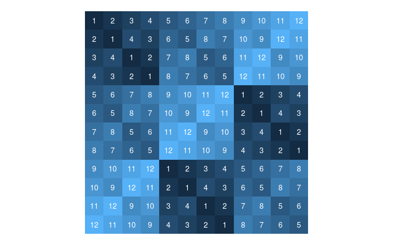

mhall-in-r
================
Matthew Henderson
15/02/2021

## Introduction

This repository contains code for generating latin squares based on the
theorem of Marshall Hall Jr. (1945) which states:

Given a rectangle of n - r rows and n columns such that each of the
numbers 1, 2, …, n occurs in every row and no number occurs twice in any
column, then there exist r rows which may be added to the given
rectangle to form a latin square.

In `R/add_rows.R` the function `add_rows` is implemented which takes as
input a latin rectangle (represented by a data frame) and outputs a new
latin rectangle with additional rows (how many rows is also specified as
input).

In this report we describe how `add_rows` function works and demonstrate
some of the generated outputs.

## Data frame representations of latin rectangles

A latin rectangle can be represented by an orthogonal array and an
orthogonal array looks just like a data frame with variables for `row`,
`column`, and `symbol`.

For example, the latin rectangle

    1 2 3
    2 3 1

can be represented by the orthgonal array data frame

``` r
library(tidyverse)

tibble(
  row = c(rep(1, 3), rep(2, 3)),
  col = rep(1:3, 2),
  symbol = c(1, 2, 3, 2, 3, 1)
)
#> # A tibble: 6 x 3
#>     row   col symbol
#>   <dbl> <int>  <dbl>
#> 1     1     1      1
#> 2     1     2      2
#> 3     1     3      3
#> 4     2     1      2
#> 5     2     2      3
#> 6     2     3      1
```

The `expand_grid` function makes it easier to construct such a data
frame from a vector of entries.

``` r
expand_grid(row = 1:2, column = 1:3) %>%
  mutate(symbol = c(1, 2, 3, 2, 3, 1))
#> # A tibble: 6 x 3
#>     row column symbol
#>   <int>  <int>  <dbl>
#> 1     1      1      1
#> 2     1      2      2
#> 3     1      3      3
#> 4     2      1      2
#> 5     2      2      3
#> 6     2      3      1
```

A benefit this representation is that it makes it easy to use the
tidyverse packages. For example, we can plot the latin square using
`ggplot2`.

``` r
expand_grid(row = 1:2, column = 1:3) %>%
  mutate(symbol = c(1, 2, 3, 2, 3, 1)) %>%
  ggplot(aes(column, row)) +
  geom_tile(aes(fill = symbol)) +
  geom_text(aes(label = symbol), colour = "white") +
  scale_y_reverse() +
  coord_fixed() +
  theme_void() +
  theme(
    legend.position  = "none",
  )
```

<!-- -->

## Extending latin rectangles

The `add_rows` function can take a data frame like this as input and
output an embedding of the latin rectangle in a latin square.

``` r
library(igraph)
library(tidygraph)

source("R/add_rows.R")
source("R/edge_tbl.R")
source("R/next_row.R")
source("R/to_tidygraph.R")

expand_grid(row = 1:2, column = 1:3) %>%
  mutate(symbol = c(1, 2, 3, 2, 3, 1)) %>%
  add_rows(3:3)
#> # A tibble: 9 x 3
#>     row column symbol
#>   <int>  <int>  <dbl>
#> 1     1      1      1
#> 2     1      2      2
#> 3     1      3      3
#> 4     2      1      2
#> 5     2      2      3
#> 6     2      3      1
#> 7     3      1      3
#> 8     3      2      1
#> 9     3      3      2
```

We can extend and plot all in one pipeline.

``` r
expand_grid(row = 1:2, column = 1:3) %>%
  mutate(symbol = c(1, 2, 3, 2, 3, 1)) %>%
  add_rows(3:3) %>%
  ggplot(aes(column, row)) +
  geom_tile(aes(fill = symbol)) +
  geom_text(aes(label = symbol), colour = "white") +
  scale_y_reverse() +
  coord_fixed() +
  theme_void() +
  theme(
    legend.position  = "none",
  )
```

<!-- -->

## Existence of latin squares

It was understood early on that Marshall Hall Jr.’s theorem provides an
existence proof for latin squares. We can always construct a 1 x n latin
rectangle (it’s just a permutation of 1, …, n). By Marhsall Hall Jr’s
theorem such a latin rectangle can always be completed to a latin
square, therefore a latin square of order n exists.

For example, to construct a latin square of order 12.

``` r
expand_grid(row = 1:1, column = 1:12) %>%
  mutate(symbol = 1:12) %>%
  add_rows(2:12) %>%
  ggplot(aes(column, row)) +
  geom_tile(aes(fill = symbol)) +
  geom_text(aes(label = symbol), colour = "white") +
  scale_y_reverse() +
  coord_fixed() +
  theme_void() +
  theme(
    legend.position  = "none",
  )
```

<!-- -->
